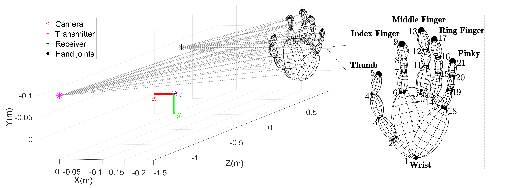
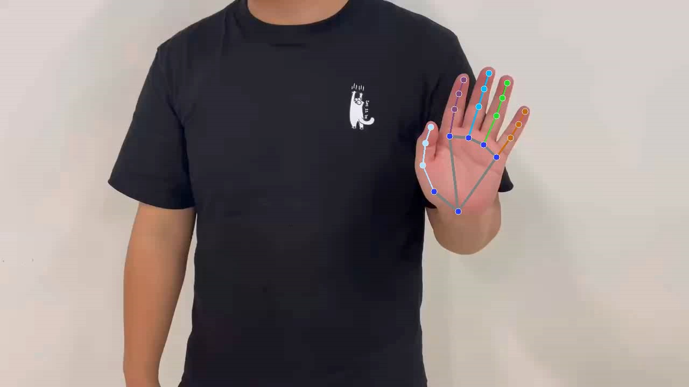
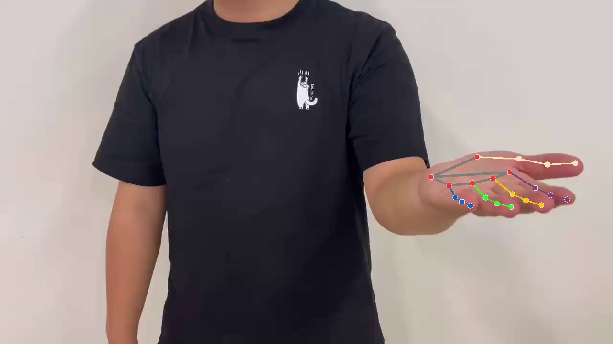
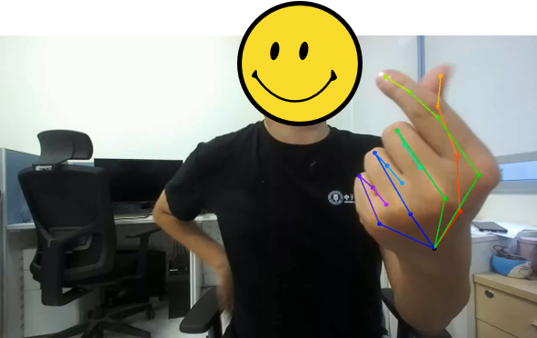
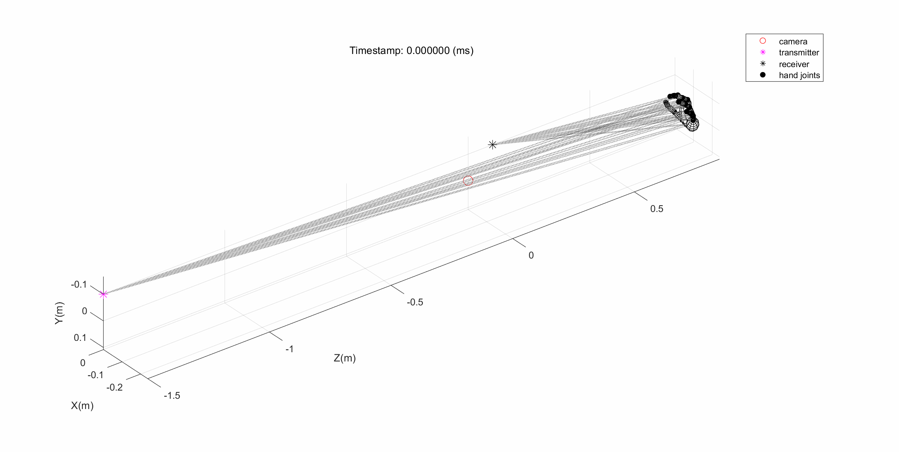
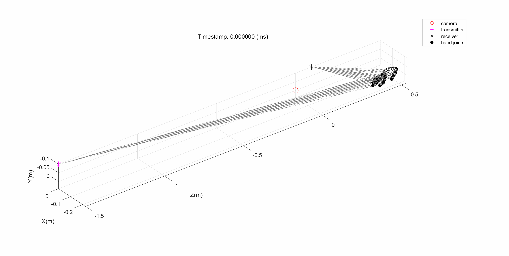
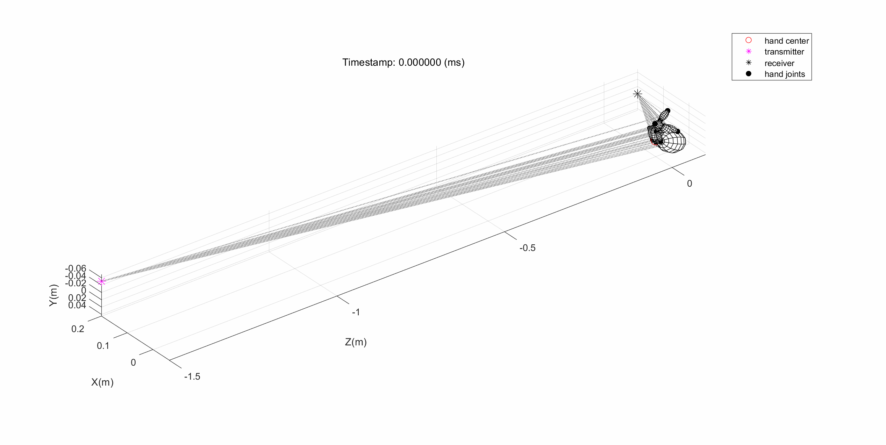
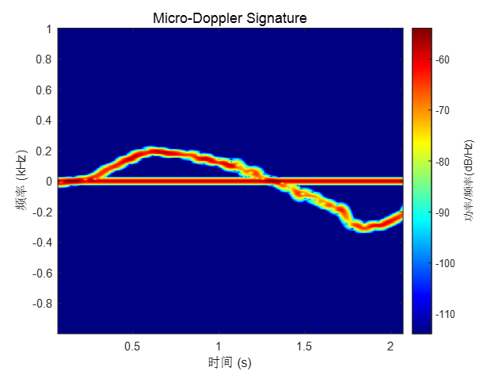
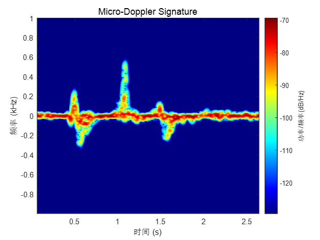
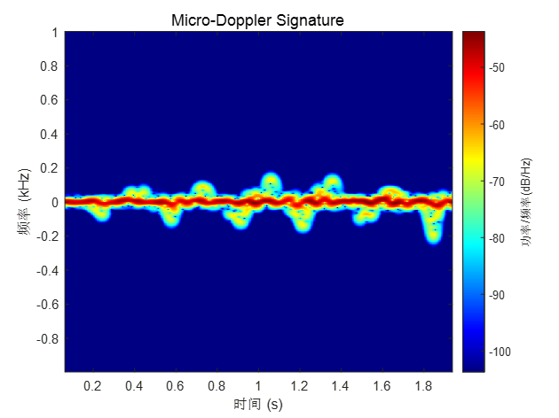

# mediapipe_spectrogram




This repository contains codes for the paper "CASTER: A Computer-Vision-Assisted Wireless Channel Simulator for Gesture Recognition".

## Demo Results

<table>
	<tbody>
		<tr>
			<td>Pushing and Pulling</td>
			<td>Beckoning</td>
			<td>Rubing Fingers</td>
		</tr>
		<tr>
			<td></td>
			<td></td>
			<td></td>
		</tr>
        <tr>
			<td></td>
			<td></td>
			<td></td>
		</tr>
        <tr>
            <td></td>
			<td></td>
			<td></td>
        </tr>
	</tbody>
</table>

## Citation

```
@misc{ren2023caster,
      title={CASTER: A Computer-Vision-Assisted Wireless Channel Simulator for Gesture Recognition}, 
      author={Zhenyu Ren and Guoliang Li and Chenqing Ji and Chao Yu and Shuai Wang and Rui Wang},
      year={2023},
      eprint={2311.07169},
      archivePrefix={arXiv},
      primaryClass={eess.SP}
}
```
